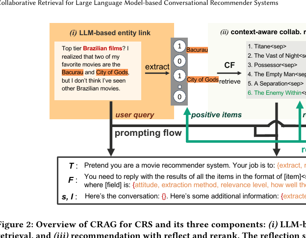

# Recommend-WWW '25- The ACM Web Conference 2025-2025-Collaborative Retrieval for Large Language Model-based Conversational Recommender Systems
*论文下载地址：https://doi.org/10.1145/3696410.3714908*

*代码是否开源：是，作者公开了代码和数据 https://github.com/yaochenzhu/CRAG*

*分享人：自动生成*

## 一句话总结内容
> 本文提出 CRAG 框架，将协同过滤的行为数据检索与大语言模型对话理解相结合，在黑盒 LLM 场景下显著提升对话式推荐的准确率与覆盖率，尤其改善对新近电影的推荐效果。

## 一句话总结创新贡献
> 工作首次在黑盒大模型场景下，以“协同检索 + 反思”的方式显式注入协同过滤知识到 LLM 对话推荐中，并系统分析双阶段反思模块对推荐质量与列表排序的影响。

## 举一个例子说明这篇文章的创新点
> 一个具体创新是“反思式协同检索”：先用基于 EASE 的协同过滤模型在用户–物品交互矩阵上，为对话中正向提及的电影检索相似候选，再让 LLM 结合对话语境逐条打二元相关标签，仅保留语义相关项目作为提示中的协同知识；随后通过“反思与重排”，让 LLM 对自己生成的推荐列表按从“非常差”到“非常好”进行打分并据此重排，纠正其在初始生成时机械沿用检索候选、忽视更合适项目所带来的排序偏差。

## 框架图

**框架工作流描述**：
> 整体流程包括三步：(1) LLM 实体链接：对每轮用户和系统话语，利用专门提示让 LLM 抽取被提及的电影及对应的五级情感态度，将结果与电影库做字符级和词级模糊匹配，再用第二次 LLM 反思在不同匹配结果间裁决，得到与数据库对齐的最终实体集合；(2) 上下文感知协同检索：将对话历史中正向提及的电影汇总为查询，在离线训练的改进版 EASE 模型上计算协同相似度，从候选库中检索 K 个相似电影，并让 LLM 结合对话逐条判断是否“符合当前需求”，过滤得到既协同相近又语义相关的候选集合与外部知识；(3) 推荐与反思重排：将对话上下文和过滤后的协同候选以 RAG 型或候选约束型 prompt 一并输入 LLM 生成推荐列表，再通过“反思与重排”模块让 LLM 为每个推荐电影打出离散质量等级并按分数重排，使最匹配需求的电影排在前列；若对话中没有显式电影提及，则先让 LLM 推断用户可能喜欢的电影，经实体链接映射到数据库后再作为协同检索输入。

## 本文挑战及已有工作不足
> 1. 简单地向 LLM 堆叠更多外部知识或协同结果往往引入大量噪声和偏置，不仅难以提升效果，反而可能破坏原有零样本推荐能力，因此需要精细的筛选与对齐机制
> 2. 现有对话式推荐的实体识别与链接多依赖监督模型和模拟数据，在缩写、拼写错误和标题歧义频繁的真实对话中噪声较大，导致下游协同检索和推荐质量受损
> 3. 在黑盒 LLM 场景下无法访问模型参数，不能像白盒开源模型那样通过联合训练或参数适配深度融合协同信号，只能依赖检索增强和提示工程实现间接协作
> 4. LLM 虽然擅长语言理解和推理，但难以直接利用推荐中至关重要的用户–物品交互矩阵，协同过滤知识既不在预训练语料中，也难以完整地用自然语言注入模型

## 印象最深刻的点
> 1. 提出“上下文感知协同检索”，先用协同过滤召回，再让 LLM 逐条判定是否与当前需求相关，实验证明相比直接把协同结果塞给 LLM，可以显著减少检索噪声带来的性能下降
> 2. 提出面向黑盒 LLM 的 CRAG 框架，将基于 EASE 的协同过滤检索与大模型的对话理解和生成紧密结合，为工业场景下复用既有行为数据资产提供了可落地的架构
> 3. 设计双层级实体链接流程：先由 LLM 抽取电影及态度，再结合字符级与词级模糊匹配，并通过 LLM 反思裁决冲突，有效缓解缩写、拼写错误和标题歧义导致的对齐问题
> 4. 提出“反思与重排”模块，让 LLM 对生成的推荐逐项打离散等级并按分数重排，有效缓解其倾向于机械复制提示中的候选、忽视更合适项目的排序偏差

## 对我们的启发
> 1. 在实体链接和知识对齐任务中，“规则匹配 + LLM 反思裁决”的双层机制能同时获得高召回与高精度，适合处理噪声大、歧义多的开放场景
> 2. 反思式重排范式（先打分再重排）可迁移到排序、摘要、多文档问答等其他 LLM 应用中，作为一种兼顾稳定性与可控性的通用后处理接口
> 3. 在无法微调黑盒 LLM 时，可训练外部协同过滤、矩阵分解或序列模型提供结构化候选与信号，再由 LLM 通过提示与反思完成最终决策
> 4. 在对话式推荐中，可将 LLM 视作高层语义与偏好裁决器，把候选召回交给协同过滤等传统模型，通过“检索 + LLM 反思筛选”叠加双方优势

## Idea是否好想
> 论文聚焦于 LLM 推荐中的一个关键空白：大模型在对话理解与自然语言推理上表现出色，却难以直接利用传统推荐系统高度依赖的协同过滤信号。作者的核心思想，是以改进版 EASE 为协同候选召回模块，在外部用户–物品交互矩阵上生成与对话中正向提及电影相似的候选，再让 LLM 在两个阶段执行“反思”：先用对话语境过滤掉协同相近但语义不相关的项目，再对最终生成的推荐列表打分重排，从而将“行为信号 + 语义理解”组合成类似工业系统“召回–粗排–精排–重排”的分层流程，同时适配黑盒 LLM 的现实约束。在方法细节上，实体链接部分没有单纯依赖 LLM 或规则，而是通过“LLM 抽取 + 字符/词级模糊匹配 + LLM 冲突反思”构成闭环，尽量把对话中的电影提及对齐到推荐目录；协同检索的 EASE 变体通过非对称映射和禁止自重构，将“可自由提及的电影空间”映射到“平台可推荐目录”，兼顾性能与实际可用性；双阶段反思模块则把 LLM 的优势放在评估与裁决上，实验证明：未经反思的协同检索可能有害，仅做上下文反思可提升覆盖但排序有限，而再加上反思式重排后，高相关项目更容易出现在列表前列，为今后在黑盒 LLM 上安全融合结构化信号提供了清晰经验。

## 是否有开创性
> 方法的新颖性主要体现在三方面：第一，在对话式推荐场景中系统性地把黑盒大语言模型与协同过滤结合，通过“协同检索增强生成”显式引入用户–物品交互知识，而非仅依赖预训练语料中隐含偏好；第二，提出带有 LLM 反思裁决的双阶段机制——协同检索之后先做上下文反思筛选，再在推荐生成后做打分重排，将 LLM 从单一生成器转变为“审阅者 + 裁判”，显著提升协同信号的可控性；第三，在实体链接上构建“LLM 抽取 + 双重模糊匹配 + LLM 反思纠偏”的双层匹配策略，针对 Reddit 真实对话中的拼写错误、缩写与歧义给出可扩展方案，并据此构建质量更高的 Reddit-v2 数据集，使 CRAG 成为围绕“如何在黑盒 LLM 中安全融合协同知识”这一问题的较完整模块化解法。

## 是否属于热点
> 本工作位于大模型驱动对话式推荐、检索增强生成在个性化场景中的应用，以及“LLM + 传统推荐模型”混合架构三个热点交汇点。随着工业界尝试将 GPT-4 级别模型用于推荐与搜索，如何在无法微调黑盒模型的前提下充分利用已有行为数据和协同过滤资产成为现实痛点；CRAG 提出的协同检索增强与反思式重排，为这一问题给出了一种具代表性的系统设计范式，也为向多模态推荐、跨领域推荐等更复杂场景扩展提供了可借鉴的思路。

## 其他需要补充的点（可选）
> 1. 实验表明，如果不引入新的外部信息，仅对零样本 LLM 推荐结果做自我反思与重排并不会带来收益，提示在设计反思链时应围绕“利用新证据”而非单纯叠加思考步骤
> 2. 作者同时使用 GPT-4 与 GPT-4o 作为对话推荐主干模型，并讨论了“电影覆盖度 vs 训练数据泄漏风险”的权衡：GPT-4 对新片知识不足但测试对话时间较晚，GPT-4o 覆盖更全但对话可能早于其训练，不过由于 Reddit 抓取接口关闭，泄漏风险被认为较低
> 3. 由于对话中的显式负向反馈极少且主观性强，作者刻意只利用正向提及构造协同检索查询，这一设定既简化建模也符合许多实际系统更依赖“喜欢信号”的做法

## 与其他论文的关联（可选）
> 1. 方法与检索增强生成（RAG）一脉相承，但检索结果来自用户–物品交互矩阵而非文本知识库，并通过两层反思严格控制协同信号对 LLM 的影响，缓解了经典 RAG 中常见的“噪声放大”问题
> 2. 与直接将 LLM 作为零样本对话推荐器的研究相比，本文在同样使用黑盒模型的前提下，引入协同检索和反思机制，大幅提升了物品覆盖率和对新电影的推荐准确度
> 3. 工作与传统协同过滤推荐密切相关，协同检索模块基于 EASE 风格线性自回归目标，继承了其高效、易解释的优点，同时面向对话提及与平台目录做了非对称扩展

## 还有哪些不足的地方（未来工作）
> 1. 从效率与成本角度优化框架，如压缩提示长度、批量化反思、多轮对话共享协同结果，以减少 LLM 调用次数并适配大规模在线服务
> 2. 将 CRAG 框架扩展到电影之外的领域（如音乐、电商商品、新闻等），系统评估在长尾更重、属性更复杂场景中协同检索与 LLM 反思的适配效果
> 3. 在开源中大型 LLM 上复现并优化 CRAG，对比“纯提示 + 检索”和“轻量参数微调 + 检索”在效果与成本上的差异，为不同资源条件下的系统设计提供指导
> 4. 探索更丰富的负向反馈与偏好约束建模方式，例如结合情感分析、拒绝表达等多源信号，在不过度放大主观噪声的前提下引入负向协同信息
