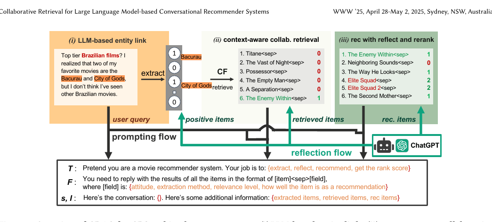

# Recommend-WWW '25- The ACM Web Conference 2025-2025-Collaborative Retrieval for Large Language Model-based Conversational Recommender Systems
*论文下载地址：https://doi.org/10.1145/3696410.3714908*

*代码是否开源：是，代码与数据已开源 https://github.com/yaochenzhu/CRAG*

*分享人：Lucian*

## 一句话总结内容
> 论文提出 CRAG 框架，将协同过滤检索与大语言模型结合用于对话式推荐，在电影对话推荐任务上显著提升覆盖率与推荐质量，尤其改善对新近电影的推荐表现。

## 一句话总结创新贡献
> 核心贡献是提出协同检索 + LLM 生成 + 双阶段反思重排的一体化框架，并借助 LLM 重构出更干净的 Reddit-v2 电影对话推荐数据集。

## 举一个例子说明这篇文章的创新点
> CRAG 先用 EASE 风格的线性协同过滤模型在用户–物品交互矩阵中检索与对话中正向提及电影相似的候选电影，再让 LLM 对这些候选执行“上下文相关性反思”进行过滤，随后对其生成的推荐列表进行第二次“反思打分与重排”，最终得到更贴合当前对话语境的排序结果。

## 框架图

**框架工作流描述**：
> 整体流程分为三步：(1) LLM 实体链接：对每轮对话发言调用 LLM 抽取被提及的电影及其态度（-2 至 2），再通过字符级与词级模糊匹配生成候选匹配结果，并用 LLM 反思裁决冲突，完成到电影库条目的精确链接；(2) 上下文感知协同检索：将当前对话历史中正向提及的电影编码为多热向量，输入基于 EASE 目标训练的线性模型，在整体交互矩阵上计算相似电影 Top-K 作为候选，再由 LLM 结合完整对话判断每个候选与当前语境是否相关，仅保留相关项并以字符串形式追加到随后提示词中；(3) 推荐生成与反思重排：在包含对话历史和协同检索候选的提示下，LLM 生成一份推荐电影列表，随后通过 reflect-and-rerank 提示让 LLM 对列表中每部电影按其作为推荐的合适程度在 -2 至 2 间打分，并据此重排得到最终结果；若对话中尚无显式物品提及，则先让 LLM 推断用户可能喜欢的电影，将其映射到物品库后视为查询，同样经过协同检索与生成–反思流程。

## 本文挑战及已有工作不足
> 1. 黑盒 LLM 难以直接利用平台私有的大规模用户–物品交互矩阵，需要设计间接注入协同过滤信号的机制
> 2. 简单向 LLM 注入更多外部知识或检索结果容易引入噪声与偏置，反而削弱其原有推理与知识能力，因此必须精细控制外部信息的筛选与使用方式
> 3. 对话式推荐需同时识别物品实体、理解自然语言上下文并判断用户态度，对缩写、拼写错误和标题歧义具有鲁棒性的实体识别与链接非常困难
> 4. 在协同检索之后，LLM 往往对提示中出现的候选存在复制偏置，倾向于机械地照单全收并排在前列，而不是依据对话语境进行真正的相关性排序

## 印象最深刻的点
> 1. 提出 CRAG 框架，将黑盒 LLM 与协同过滤显式结合，并通过“两级反思”（候选过滤与重排）控制检索噪声与最终排序质量
> 2. 作者使用 GPT-4o 重新标注和清洗 Reddit 电影对话推荐数据集构建 Reddit-v2，并通过随机替换电影名的实验证明物品提及信号以及新数据集提纯效果的关键作用
> 3. 协同检索采用 EASE 风格线性模型学习物品–物品相似度并禁止自重建，实现从自由提及电影空间到可推荐目录的高效映射
> 4. 实体链接模块利用 LLM 同时完成电影抽取与用户态度识别，再结合字符级与词级模糊匹配以及二次反思裁决，有效应对缩写、拼写错误和标题歧义

## 对我们的启发
> 1. 结果表明对话中显式提及的物品极为关键，提示在设计对话式推荐和交互系统时应鼓励用户自然地提到喜欢或不喜欢的具体对象，为算法提供高价值的结构化偏好信号
> 2. 协同过滤检索后端不必依赖复杂深度模型，简单的 EASE 式线性目标即可提供高质量邻居，作为 RAG 场景中高性价比的行为检索模块
> 3. 在复杂实体抽取与链接任务中，将字符/词级模糊匹配与 LLM 反思裁决结合，比单一方案更鲁棒，这一思路可推广到多领域知识图谱对齐与实体链接场景
> 4. 可将 LLM 视作强大的语义裁判与反思器，用来过滤和重排传统推荐模型的输出，而非完全依赖 LLM 直接生成推荐列表，为其它推荐任务提供了通用的“推荐模型 + LLM 反思”范式

## Idea是否好想
> 该工作通过“协同检索 + LLM 反思”的方式，将传统协同过滤的行为信号与大模型的语义理解能力拼接在一起：协同过滤擅长从用户–物品交互中捕捉“看了 A 也可能看 B”的统计共现，但不理解具体对话语境；LLM 则善于理解自然语言和电影知识，却无法直接访问平台私有的交互矩阵。CRAG 的做法是先利用对话中正向提及的电影构造多热查询向量，经由基于 EASE 目标训练的线性映射，从全物品空间检索出协同相似的候选，再让 LLM 结合对话历史进行“上下文反思”过滤，例如在讨论“巴西电影”时仅保留真正来自巴西或高度相关的影片。完成高质量候选筛选后，LLM 在包含候选和对话语境的提示下生成推荐列表，但考虑到其对提示中候选的复制偏置，作者进一步引入第二次“反思打分与重排”，让 LLM 先对每个候选独立打分，再据此排序，从而把 LLM 的角色从单纯的生成器转变为“审阅者 + 裁判”。消融实验表明：若只把协同候选直接塞给 LLM，效果有限甚至会被噪声拖累；加入上下文反思后，召回候选质量明显提高，但前几位排序仍不稳定；只有再叠加反思重排，Top-k 推荐质量才持续提升，这说明 LLM 在“识别和评估好候选”方面往往比“凭空发明候选”更强。

## 是否有开创性
> 论文自称首次在对话式推荐场景下，将最先进的黑盒 LLM 与协同过滤显式结合，形成检索–反思–生成–再反思的闭环框架：协同模块直接从真实用户–物品交互矩阵中学习协同相似度，并以候选形式注入 LLM；两个基于 LLM 的反思模块分别承担检索噪声过滤与列表排序纠偏的职责，针对性地缓解了 RAG 检索噪声和 LLM 复制偏置问题。在实体链接方面，论文采用“LLM 抽取 + 态度识别 + 模糊匹配 + 二次反思裁决”的组合策略，相比以往依赖模拟数据微调小模型的方案，更贴合真实对话数据的噪声特征。除方法外，作者还系统重建了 Reddit 对话推荐数据集的实体标注，构造 Reddit-v2，并用对比实验量化清洗带来的收益，整体上在模型设计与数据构建两端都体现出较强的新意。

## 是否属于热点
> 本文交汇了多个当前研究热点：大语言模型驱动的推荐系统与对话式推荐、检索增强生成（RAG）与协同过滤的结合、在黑盒 LLM 场景下高效利用平台私有行为数据、LLM 自反思机制在排序与决策中的应用，以及面向开放域社交媒体对话数据的高质量推荐数据集构建与清洗。

## 其他需要补充的点（可选）
> 1. 论文指出，仅让 LLM 对自己生成的推荐结果做自反思，在缺乏外部信号时几乎没有收益，强调了协同检索等外部知识对于有效纠偏和提升推荐质量的重要性
> 2. 在对话尚无物品提及时，CRAG 先让 LLM 推断用户可能喜欢的电影，再将这些推断结果映射到物品库作为查询进行协同检索，从而在“冷启动对话轮次”下用 LLM 推理弥补行为信号缺失
> 3. 作者区分真实用户集合 U 与构造交互矩阵的伪用户集合 U_r，在 Reddit-v2 中将每个对话视作一个伪用户，其正向提及的电影构成该伪用户的历史行为，这在缺乏显式用户标识的数据上具有较强实用性

## 与其他论文的关联（可选）
> 1. 与传统协同过滤方法（如矩阵分解和基于相似度的 CF）相比，CRAG 并未用深度模型替代协同模块，而是采用简洁高效的 EASE 风格线性模型负责协同检索，再用 LLM 弥补其在语义理解和对话建模方面的不足
> 2. 与利用协同过滤信号对白盒 LLM 进行微调或偏好对齐的研究不同，CRAG 专注于黑盒 LLM 场景，通过 RAG 管线与提示设计在不触及模型参数的前提下接入平台行为数据，更契合现实中部署闭源商用 LLM 的需求
> 3. 相比早期使用 Factorization Machines、RNN 以及依赖 DBpedia、ConceptNet 等知识图谱的对话式推荐工作，CRAG 不再显式构造知识图谱，而是将 LLM 视为隐式知识库，并通过协同检索显式引入行为层面的协同信息

## 还有哪些不足的地方（未来工作）
> 1. 研究更系统的负反馈建模方式，在保证鲁棒性的前提下充分利用对话中的负向物品提及，而非简单剔除，以更好支持“避雷型”需求
> 2. 从效率与成本角度优化双阶段 LLM 反思流程，例如用轻量级排序模型或蒸馏模型部分替代 LLM 在反思与重排中的角色，减少调用次数
> 3. 将 CRAG 扩展到更多领域和多模态推荐场景，如音乐、商品、电商评论或包含海报与预告片的视频推荐，探索协同检索与多模态 LLM 的协同效果
> 4. 在白盒或可微调 LLM 场景下，探索如何将 CRAG 的协同检索和反思信号用于参数更新，实现真正的“行为对齐”，而不仅仅停留在推理阶段的提示增强
